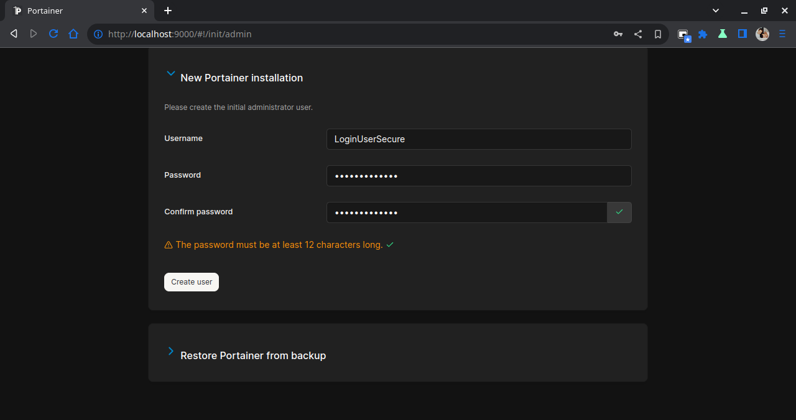
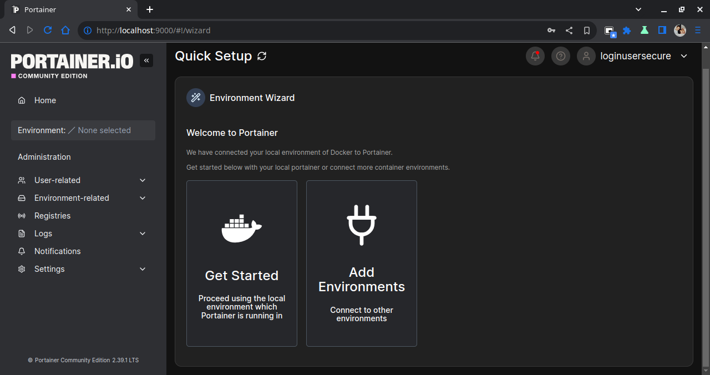
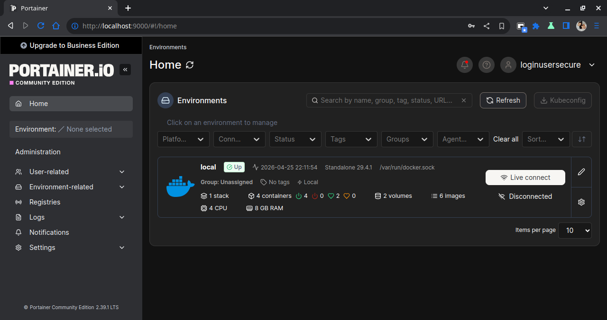
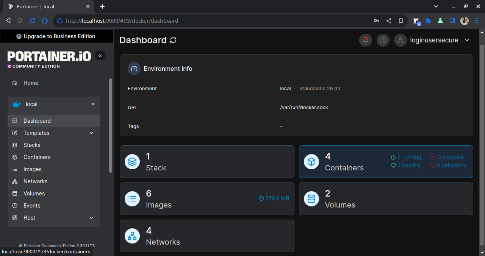
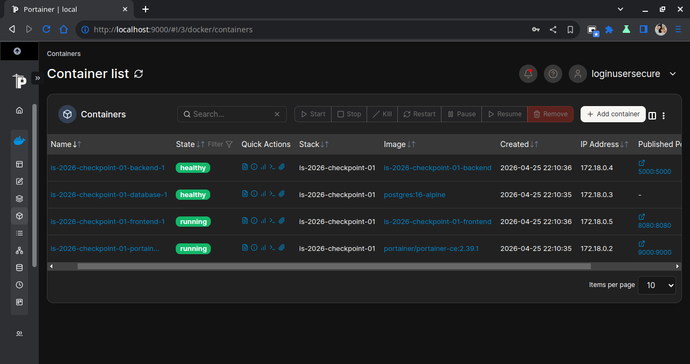

# IS-2026 Checkpoint 01 - TeamBoard App

## Integrantes y Roles
| Nombre | Legajo | Feature | Servicio |
|--------|--------|---------|----------|
| Melissa Braunstein | 33535 | Feature 01 | Coordinador |
| Pilar Wagner | 33514 | Feature 02 | Frontend |
| Santiago Gonzales D'Angelo | 33211 | Feature 03 | Backend |
| Maria Pia Porzio | 33243 | Feature 04 | Database |
| Leandro Andres Noval | 32201 | Feature 05 | Portainer |

## Cómo ejecutar el proyecto
1. Clonar el repositorio.
2. Crear el archivo `.env` basado en `.env.example`.
3. Ejecutar:
   ```bash
   docker compose up -d --build
   ```

## Servicios
- **Frontend**: http://localhost:8080
- **Backend**: http://localhost:5000
- **Portainer**: http://localhost:9000


# Feature 01: Coordinación y Estructura Base

Esta documentación detalla las tareas realizadas para la Feature 01 del proyecto, centrada en la coordinación del equipo, la estructuración de la arquitectura de contenedores y la definición de estándares de calidad.

## 1. Estructura del Proyecto

```text
/
├── backend/                 # Lógica de la API (Python)
│   ├── Dockerfile           # Configuración de imagen del backend
│   ├── main.py              # Punto de entrada de la aplicación
│   └── requirements.txt     # Dependencias del proyecto
│
├── database/                # Persistencia y Esquemas
│   └── init.sql             # Script de creación de tablas y vista 'members'
│
├── frontend/                # Interfaz de Usuario
│   ├── Dockerfile           # Configuración de imagen del servidor web
│   ├── index.html           # Estructura principal
│   └── src/                 # Código fuente (JS, CSS)
│
├── .env                     # Variables locales (NO SUBIR AL REPO)
├── .env.example             # Plantilla de configuración para el equipo
├── .gitignore               # Exclusión de archivos sensibles y temporales
├── docker-compose.yml       # Orquestador maestro de servicios y redes
└── README.md                # Documentación principal y guía de inicio### Componentes y Documentos

```
## 2. GitFlow elegido:

* **Por Features**: Se eligió este GitFlow para facilitar los Pull Request y los merges. Debido a la simpleza del proyecto se consideró innecesario sumar rama development, ya que cada participante pudo organizarse y trabajar ordenadamente en su respectiva rama la feature que le correspondía.

## 3. Métricas de Calidad y Estándares

Para garantizar la robustez del sistema, se implementaron las siguientes métricas y configuraciones:

| Estándar | Práctica | Archivo | Explicación |
| :--- | :--- | :--- | :--- |
| Seguridad y Aislamiento | Aislamiento de Red |`docker-compose.yml` | La base de datos no expone puertos al host (0.0.0.0) |
| Seguridad y Aislamiento | Variables de entorno |`.env` |No se incluyen credenciales en el código fuente |
| Healthcare | Orden de encendido |`docker-compose.yml` |Se utiliza `depends_on` con condiciones de salud (`service_healthy`). El Frontend no inicia hasta que el Backend está listo, y este espera a la base de datos.|
| Healthcare | Monitoreo |`docker-compose.yml` |Cada servicio cuenta con un test de salud (`curl` para el backend y `pg_isready` para la base de datos)|
| Gestión de Recursos | Límites de Hardware |`docker-compose.yml` |Se han definido límites estrictos de CPU (0.25 - 0.5) y Memoria (256M - 512M) por contenedor para evitar el agotamiento de recursos en el host |

## Feature 03 — Backend con Flask

Esta feature se encargó de implementar el backend de la aplicación utilizando Flask, con el objetivo de exponer una API REST que permita consultar la información del equipo almacenada en la base de datos.

### Objetivo

El objetivo principal fue desarrollar una API simple pero funcional, integrarla con Docker Compose y dejar preparada una estructura que permita la comunicación entre el frontend y la base de datos.

### Archivos involucrados

```text
backend/
├── app.py            # Lógica principal de la API
├── requirements.txt  # Dependencias del proyecto
├── Dockerfile        # Configuración de la imagen del backend
└── .dockerignore     # Exclusión de archivos innecesarios
```

### Decisiones de diseño

Se optó por utilizar Flask como framework para el backend por su simplicidad y facilidad de integración.

Se definieron tres endpoints principales:

- `/api/health`: permite verificar que el backend esté funcionando correctamente.
- `/api/info`: devuelve información básica del servicio.
- `/api/team`: consulta la base de datos y devuelve los integrantes del equipo.

Para la conexión con PostgreSQL se utilizó la librería `psycopg2`, leyendo las credenciales desde variables de entorno para evitar hardcodear información sensible.

Se decidió utilizar la vista `members` definida en la base de datos en lugar de consultar directamente las tablas, con el fin de simplificar la lógica del backend y evitar realizar joins complejos en cada consulta.

Además, se utilizó `gunicorn` como servidor WSGI para ejecutar la aplicación dentro del contenedor, en lugar del servidor de desarrollo de Flask.

### Buenas prácticas aplicadas

- uso de variables de entorno para la configuración de la base de datos
- separación de dependencias mediante `requirements.txt`
- uso de imagen base `python:3.12-slim`
- ejecución del contenedor con usuario no-root
- implementación de `HEALTHCHECK`
- uso de `.dockerignore`
- habilitación de CORS para comunicación con el frontend

### Pruebas realizadas

Se realizaron pruebas tanto a nivel de API como de integración con Docker:

- verificación del endpoint `/api/health`
- verificación del endpoint `/api/info`
- ejecución del backend con `gunicorn` dentro del contenedor
- validación de conexión con PostgreSQL
- prueba del endpoint `/api/team` contra la vista `members`
- pruebas con `curl` y navegador
- validación de CORS para requests desde otro puerto

### Observaciones

Durante el desarrollo, el endpoint `/api/team` no pudo ser validado completamente en una primera instancia debido a la falta de disponibilidad de la base de datos. Una vez integrada la base mediante Docker Compose, se validó el flujo completo entre backend y PostgreSQL.

Se incorporó CORS para permitir la comunicación entre frontend y backend en distintos puertos, algo necesario en entornos de desarrollo.

# Feature 04: Base de Datos con PostgreSQL

Esta feature se encargó de implementar la base de datos de la aplicación usando PostgreSQL, con el objetivo de almacenar la información del equipo y dejarla disponible para que el backend pudiera consultarla correctamente.

## 1. Objetivo

El objetivo principal fue armar una base de datos inicial funcional y dejar preparada una estructura que no solo sirviera para este checkpoint, sino que también fuera más ordenada y escalable a futuro.

## 2. Archivos involucrados

- `database/init.sql`

## 3. Decisiones de diseño

En vez de usar una sola tabla con toda la información mezclada, se decidió separar la base en tres tablas:

- `integrantes`: guarda los datos personales de cada integrante (`legajo`, `nombre`, `apellido`)
- `estados`: guarda los posibles estados de cada asignación (`Activo`, `Inactivo`, `En Proceso`, `Pendiente`)
- `member_features`: relaciona a cada integrante con su feature, servicio y estado

Esta decisión se tomó para seguir buenas prácticas de modelado, evitar repetir información innecesariamente y dejar una estructura más clara y escalable. De esta manera, un mismo integrante puede tener más de una feature sin duplicar sus datos personales, y la base queda mejor preparada para futuras ampliaciones.

También se creó una vista `members`, pensada para simplificar el trabajo del backend. Aunque internamente la información está separada en varias tablas, la vista devuelve los datos ya unificados (`nombre`, `apellido`, `legajo`, `feature`, `servicio`, `estado`). Así, la API puede consultar la información de forma más simple, sin tener que repetir joins complejos en cada consulta.

## 4. Buenas prácticas aplicadas

- inicialización automática de la base mediante `init.sql`
- diseño relacional más ordenado y escalable

## 5. Pruebas realizadas

Se probó el servicio `database` de forma aislada con Docker Compose y se verificó que:

- PostgreSQL levantara correctamente
- `init.sql` se ejecutara sin errores
- se crearan las tablas y la vista
- la consulta esperada por el backend devolviera los datos correctamente
- se pudieran insertar nuevos integrantes, agregar nuevas features y actualizar estados

## 6. Observaciones

Durante el desarrollo se llegó a modificar `.env.example` para dejar más claras las variables de entorno necesarias para la conexión entre backend y base de datos, con la intención de servir como guía para la configuración local del equipo.

Sin embargo, después se consideró que no era lo más correcto incluir ese cambio dentro de esta feature, ya que `.env.example` forma parte de la configuración general del proyecto y no específicamente de la lógica de base de datos.

Es importante aclarar que los valores incluidos eran solo orientativos: no eran las credenciales reales del archivo `.env` local ni se usaron como configuración efectiva durante las pruebas. Por ese motivo, el cambio fue retirado del PR y las credenciales reales quedaron únicamente en el `.env` local, que no se subió al repositorio.

## Feature 05 — Panel de Monitoreo con Portainer

Esta feature se encargó de implementar el panel de monitoreo de la aplicación usando Portainer, con el objetivo de visualizar y administrar los contenedores del proyecto desde una interfaz web, sin depender exclusivamente de la terminal.

### Objetivo

El objetivo principal fue integrar Portainer dentro de Docker Compose para facilitar la observabilidad del entorno, validar el estado de los servicios del stack y dejar una configuración persistente y reproducible para todo el equipo.

### Archivos involucrados

- 'docker-compose.yml'
- 'README.md'

### Decisiones de diseño

Siguiendo lo indicado por la consigna, se utilizó Portainer sin Dockerfile propio y se configuró directamente en Docker Compose.

Además, se decidió reemplazar la imagen versionada dinámicamente por una versión fija:

- antes: 'image: portainer/portainer-ce:latest'
- ahora: 'image: portainer/portainer-ce:2.39.1'

Esta decisión se tomó para cumplir con la buena práctica de usar versiones fijas en lugar de 'latest', mejorar la reproducibilidad entre entornos y evitar cambios inesperados por actualizaciones automáticas de la imagen.

También se mantuvieron los montajes obligatorios para el correcto funcionamiento del servicio:

- socket Docker: '/var/run/docker.sock:/var/run/docker.sock'
- volumen persistente: 'portainer_data:/data'

De esta manera, Portainer puede comunicarse con el daemon de Docker y conservar su configuración entre reinicios.

### Buenas prácticas aplicadas

- uso de imagen fija ('2.39.1') en lugar de 'latest'
- configuración del servicio en 'docker-compose.yml' sin Dockerfile adicional
- montaje de volumen persistente para conservar configuración del panel
- integración con el daemon Docker mediante el socket del host
- definición de límites de recursos en Docker Compose

### Pruebas realizadas

Se probó el servicio 'portainer' dentro del stack con Docker Compose y se verificó que:

- Portainer levantara correctamente en el puerto configurado
- el acceso web respondiera en 'http://localhost:9000'
- en el primer ingreso se pudiera crear el usuario administrador
- se pudiera seleccionar y conectar el entorno local de Docker
- se visualizaran los contenedores del proyecto en estado operativo

### Observaciones

La modificación de 'latest' a '2.39.1' se incorporó específicamente para alinear la feature con el criterio de buenas prácticas de la consigna, priorizando estabilidad y consistencia en las ejecuciones del equipo.

### Paso a paso

1. Levantar servicios con: docker compose up -d --build
2. Abrir Portainer en el navegador: `http://localhost:9000`
3. Primer ingreso: crear usuario administrador priorizando credenciales seguras (si ya existe, iniciar sesión con las credenciales conocidas).
4. Entrar al entorno local: **Local** (Docker environment).
5. Ir a **Containers** y abrir algún contenedor, ejemplo el contenedor del backend.
6. Entrar en la sección **Stats** con un `i` para ver consumo en tiempo real (CPU, memoria, red e I/O).

### Evidencias









